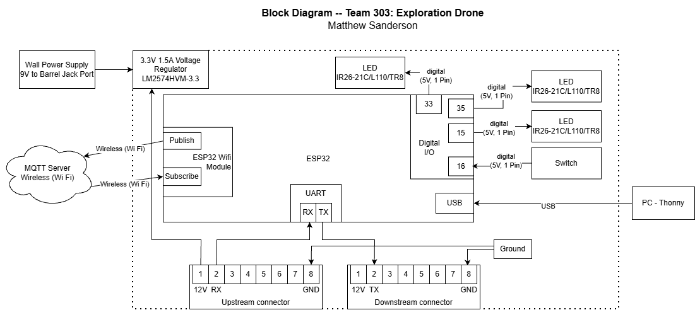

## Overview
This is a breakdown of the parts of the wireless subsystem.

* power levels
* RX and TX connection to other subsystems in loop
* Power source

## Block Diagram of Wireless Subsytem
Here is the block diagram for the wireless subsystem of the Exploration Drone Project.

## Decision Making Process
The logic behind the block diagram for my subsystem was to make sure there was a RX and TX connection to the other subsystems. The rest was just having enough LED's and buttons for debugging and testing.

**Figure 02:** Showing my block diagram of the wireless subsystem.
