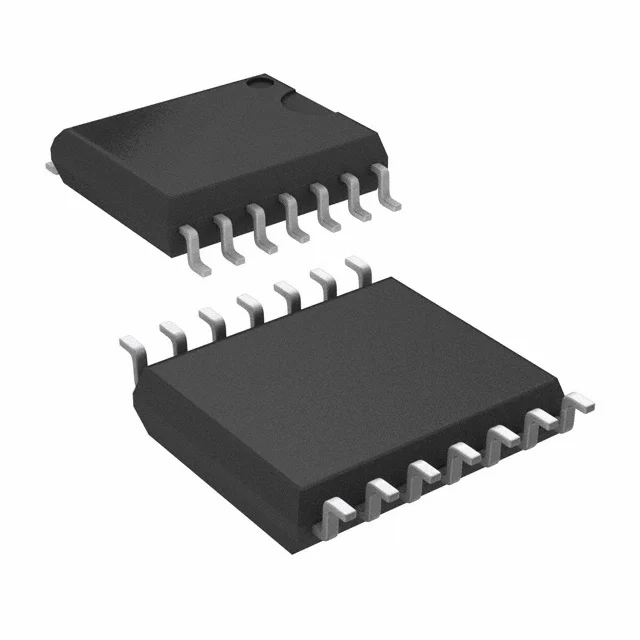

## Component Selection

* Voltage Regulator
* WiFi Chip
* ESP32

**Power Management**

1. MIC5365-3.3YC5-TR surface mount voltage regulator

    

    * $0.12/each
    * [link to product](https://www.digikey.com/en/products/detail/microchip-technology/MIC5365-3-3YC5-TR/1868094)

    | Pros                                      | Cons                                                             |
    | ----------------------------------------- | ---------------------------------------------------------------- |
    | 3.3V output                               | Max inpute voltage 5.5V                                          |
    | Cheap                                     | Needs special PCB layout.                                        |
    | Wide operating temperature range          |
    | Meets surface mount constraint of project |

**Rationale:** Affordable linear voltage regulator.

2. TCR2EF33LM surface mount voltage regulator

    

    * $0.12/each
    * [link to product](https://www.digikey.com/en/products/detail/toshiba-semiconductor-and-storage/TCR2EF33-LM-CT/4503183)

    | Pros                                      | Cons                                                             |
    | ----------------------------------------- | ---------------------------------------------------------------- |
    | 3.3V output                               | Max inpute voltage 5.5V                                          |
    | Cheap                                     | Needs special PCB layout.                                        |
    | Wide operating temperature range          |
    | Meets surface mount constraint of project |

**Rationale:** Affordable linear voltage regulator.

3. AZ1117CH-3.3TRG1 surface mount voltage regulator

    

    * $0.16/each
    * [link to product](https://www.digikey.com/en/products/detail/diodes-incorporated/AZ1117CH-3-3TRG1/4470985)

    | Pros                                      | Cons                                                             |
    | ----------------------------------------- | ---------------------------------------------------------------- |
    | 3.3V output                               | Fixed output                                                     |
    | Cheap                                     | Needs special PCB layout.                                        |
    | Wide operating temperature range          |
    | Meets surface mount constraint of project |

**Rationale:** Affordable linear voltage regulator.

3. LM2574HVM-3.3/NOPB surface mount voltage regulator

    

    * $5.31/each
    * [link to product](https://www.digikey.com/en/products/detail/texas-instruments/LM2574HVM-3-3-NOPB/363631)

    | Pros                                      | Cons                                                             |
    | ----------------------------------------- | ---------------------------------------------------------------- |
    | 3.3V output                               | Expensive                                                        |
    | Variable Output                           | Needs special PCB layout.                                        |
    | Wide operating temperature range          | More complicated wiring                                          |
    | Meets surface mount constraint of project |

**Rationale:** Meets power requirements of project.

**WiFi Chip**

1. WFM200S022XNA3 surface mount WiFi Module

    

    * $11.16/each
    * [link to product](https://www.mouser.com/ProductDetail/Silicon-Labs/WFM200S022XNA3?qs=vEM7xhTegWgk98Fa7%252BnIXQ%3D%3D)

    | Pros                                      | Cons                                                             |
    | ----------------------------------------- | ---------------------------------------------------------------- |
    | 801.11 Certified                          | Requires external components and support circuitry for interface |
    | Built in antenna                          | Needs special PCB layout.                                        |
    | Low voltage 3.3V                          |
    | Meets surface mount constraint of project |

**Selected Component**
**Rationale:** A all inclusive WiFi module will be easier to use than separate antenna and clock.

2. ATWINC1510-MR210PB1140 surface mount WiFi Module

    

    * $11.27/each
    * [link to product](https://www.mouser.com/ProductDetail/Microchip-Technology/ATWINC1510-MR210PB1140?qs=Mv7BduZupUguuZrYLIgJBw%3D%3D)

    | Pros                                      | Cons                                                             |
    | ----------------------------------------- | ---------------------------------------------------------------- |
    | 801.11 Certified                          | Requires external components and support circuitry for interface |
    | Built in antenna                          | Needs special PCB layout.                                        |
    | Low voltage 3V                            |
    | Meets surface mount constraint of project |

**Rationale:** A all inclusive WiFi module will be easier to use than separate antenna and clock.

3. LILY-W132-00B surface mount WiFi Module

    

    * $6.79/each
    * [link to product](https://www.mouser.com/ProductDetail/u-blox/LILY-W132-00B?qs=sPbYRqrBIVk39TYtwnGDxw%3D%3D)

    | Pros                                      | Cons                                                             |
    | ----------------------------------------- | ---------------------------------------------------------------- |
    | 801.11 Certified                          | Max supply voltage 3.6V |
    | Built in antenna                          | Needs special PCB layout.                                        |
    | Low voltage 3V                            |
    | Meets surface mount constraint of project |

**Rationale:** A all inclusive WiFi module will be easier to use than separate antenna and clock.

