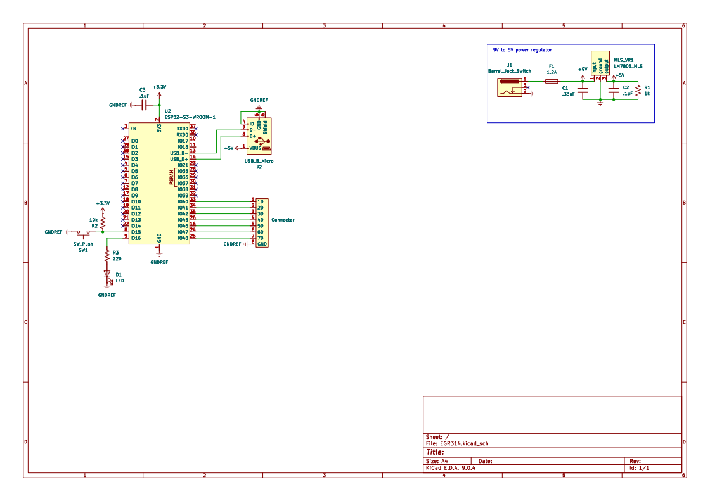

## Overview

This schematic is design to connect to an external server through Wi-Fi to send telemetry and receive control commands.

{style width:"350" height:"300;"}
**Figure ##:** Showing a example schematic.

## Resouces

The schematic as a PDF download is available [*here*](EGR314.pdf), and the Zip folder of the project [*here*](EGR314.zip).
