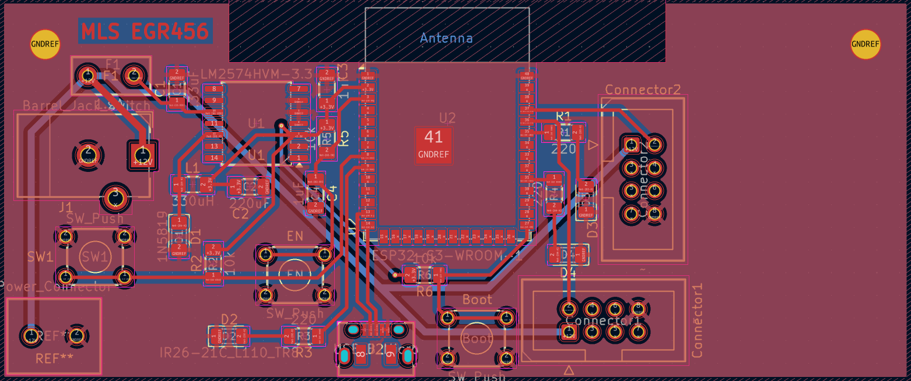
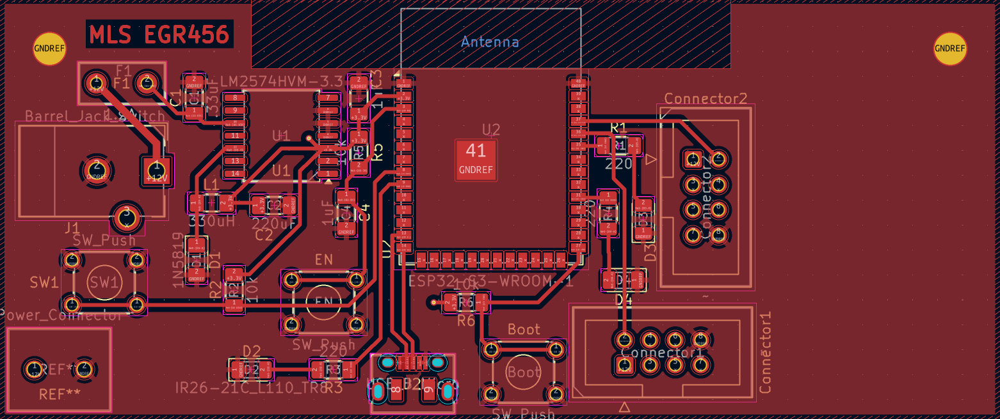
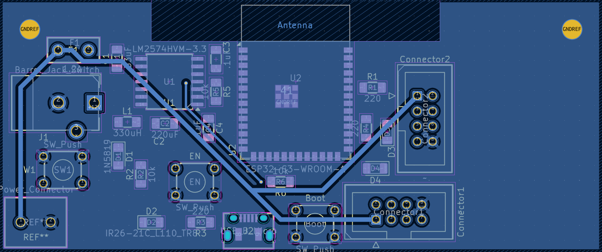

## Overview

This PCB is the custom circuit for this project. The main component is the ESP32 microcontroller.

{style width:"350" height:"300;"}
**Figure ##:** Showing my PCB of the wireless subsystem.

{style width:"350" height:"300;"}
**Figure ##:** Showing the front of my PCB of the wireless subsystem.

{style width:"350" height:"300;"}
**Figure ##:** Showing the back of my PCB of the wireless subsystem.

## Resouces

The gerber files of the PCB are available [*here*](PCB.zip).
