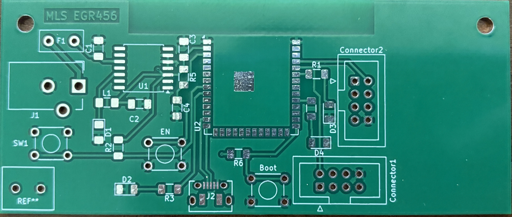
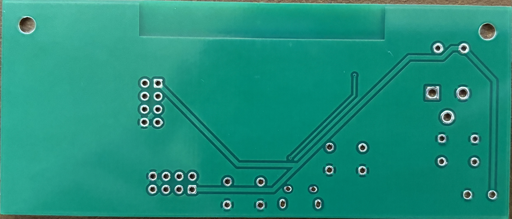
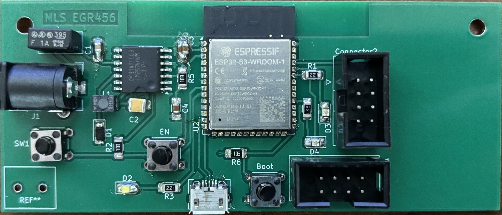
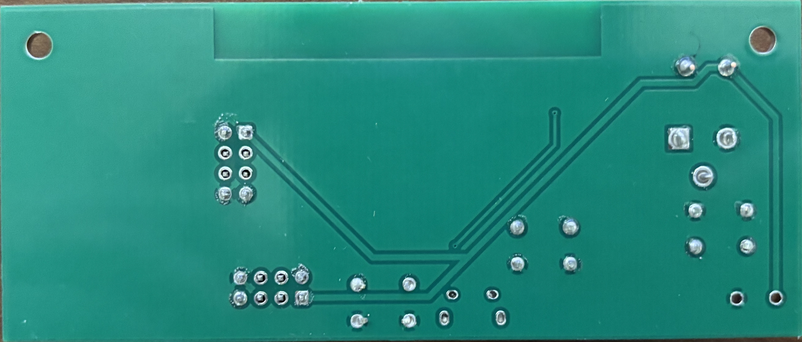

## Overview
# PCB Layout
This PCB is the custom circuit for this project. The main component is the ESP32 microcontroller.

{style width:"350" height:"300;"}
**Figure 06:** Showing my PCB of the wireless subsystem.

{style width:"350" height:"300;"}
**Figure 07:** Showing the front of my PCB of the wireless subsystem.

{style width:"350" height:"300;"}
**Figure 08:** Showing the back of my PCB of the wireless subsystem.

## Photos

**Figure 09:** Showing the front of the bare PCB.

**Figure 10:** Showing the back of the bare PCB.

**Figure 11:** Showing the front of the populated PCB.

**Figure 12:** Showing the back of the populated PCB.

## Resouces

The gerber files of the PCB are available [*here*](PCB.zip).
